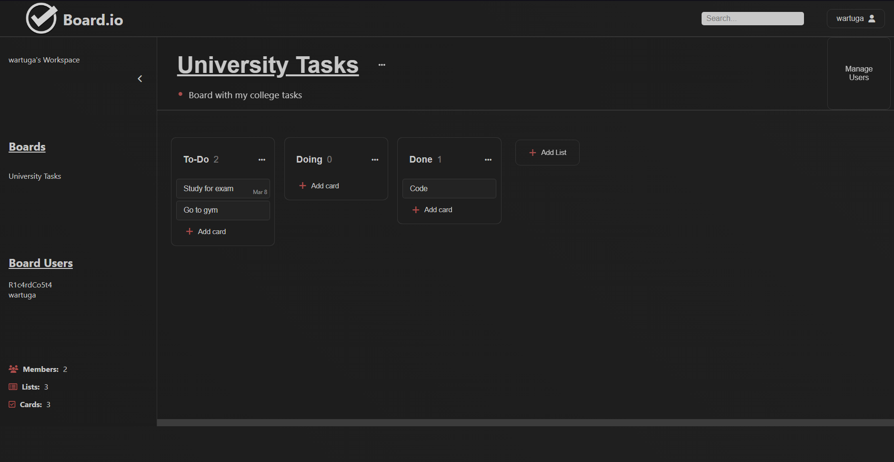

# Software Laboratory - Project Report
## ISEL - LS - LEIC41D - G08
> Ricardo Costa - 49511 \
> Diogo Almeida - 49449

&nbsp;

## Introduction

This report contains the relevant design and implementation aspects of the this project, 
which involves the analysis, design, and implementation of an information system for task management, 
inspired by the *Trello* application, which is a tool to help manage any type of project, workflow, 
or task. The goal of this project was to provide a `REST API` for managing tasks, 
allowing users to organize their work in a simple and efficient way.

The domain of the project is defined by the `User`, `Board`, `List`, and `Card` entities:
- A user is characterized by a unique id, name and email, and also a password;
- A board represents a project, having a unique name and description, which can be associated with one or several users.
- Each board is divided into lists, with each one having a unique name in the board.
- Each list contains a sequence of cards that represent single tasks, each one inside a single list, and each card can be
characterized by a name, description and due date.

All entities implement the `Domain` Interface, which contains the id, name and creation date properties.

The backend service was developed using was developed using the Kotlin language, with the `Http4K` and the 
`kotlinx.serialization` libraries for handling HTTP requests and body serialization/deserialization. 
The frontend application, uses that API for user, board, list and card management, and was developed
using the HTML, CSS and JavaScript languages, to develop a Single-Page Application (SPA).
The API requires authentication and authorization for certain actions. 
The application's data can either be stored in a PostgresSQL database or stored in memory.

The next sections of the report provide a detailed description of the functionalities implemented.

&nbsp;

## Modeling the database

### Conceptual model ###

The following diagram holds the Entity-Relationship model for the information managed by the system:

And this one with the Relational Model:

Since the board name needs to be unique in the database, if a user wants to create a board with a name
that already exists, it is kind of frustrating for the user to have to choose a different board name.

The conceptual model has the following restrictions:
- The `dueDate` needs to be after the `createdDate`;
- An `id` needs to be greater or equal than 1 and an `index` needs to be greater or equal than 0;
- An `email` needs to be in the correct format;
- A `date` (timestamp) needs to be in the YYYY-MM-DDThh:mm:ss format.

### Physical Model ###

The physical model of the database is available [here](../src/main/sql/createSchema.sql).

We highlight the following aspects of this model:
- The model uses a relational database schema with tables for users, boards, lists, and cards, which allows for 
efficient querying and management of the data;
- Each table has a serial primary key, which ensures that each record has a unique identifier;
- We chose to use serial integer primary keys consistently throughout the model, even in cases where an entity already had
an alternative key. This decision was made for consistency, simplicity and avoiding having to deal with composite keys;
- The model also includes foreign keys to establish relationships between tables, such as associating a list with a 
specific board;
- Since the relationship between the users and the boards is many-to-many, we have an extra table to establish that
relationship, with the primary key being the composite key of both the ids of the user and the board.

## Software organization

### Open-API Specification ###

The YAML file containing the Open-API specification can be found [here](./boardio-api-spec.yml).
In our `Open-API` specification, we highlight the following aspects:
- There are schemas for every entity, request, response and error involving all the API requests;
- The possible status codes returned by the API are **200**, **201**, **400**, **401**, **403**, **404**, **409** and **500**;
- The API requires authentication for all the operations, except for the `createUser` and `getUser` operations;
  
The routes for this API are:

- UserApi

| Method   |              Route            |     Operation     |
|----------|-------------------------------|-------------------|
| GET      | `/api/users/`                 | Get Users         |
| POST     | `/api/users/`                 | Create User       |
| PATCH    | `/api/users/`                 | Update User       |
| DELETE   | `/api/users/`                 | Delete User       |
| GET      | `/api/users/{userId}`         | Get User          |
| POST     | `/api/users/login`            | Login User        |
| GET      | `/api/users/token/{token}`    | Get User By Token |
| GET      | `/api/users/name/{name}`      | Get User By Name  |

- BoardApi

| Method   |               Route             | Operation              |
|----------|---------------------------------|------------------------|
| GET      | `/api/boards/`                  | Get User Boards        |
| POST     | `/api/boards/`                  | Create Board           |
| GET      | `/api/boards/{boardId}`         | Get Board              |
| PATCH    | `/api/boards/{boardId}`         | Update Board           |
| DELETE   | `/api/boards/{boardId}`         | Delete Board           |
| GET      | `/api/boards/{boardId}/lists`   | Get Board Lists        |
| GET      | `/api/boards/{boardId}/users`   | Get Board Users        |
| PUT      | `/api/boards/{boardId}/add`     | Add User To Board      |
| PUT      | `/api/boards/{boardId}/remove`  | Remove User From Board |

- ListApi

| Method   |              Route            |     Operation     |
|----------|-------------------------------|-------------------|
| POST     | `/api/lists/`                 | Create List       |
| GET      | `/api/lists/{listId}`         | Get List          |
| PATCH    | `/api/lists/{listId}`         | Update List       |
| DELETE   | `/api/lists/{listId}`         | Delete List       |
| GET      | `/api/lists/{listId}/cards`   | Get List Cards    |
| PATCH    | `/api/lists/{listId}/move`    | Move List         |

- CardApi

| Method   |              Route            |       Operation       |
|----------|-------------------------------|-----------------------|
| POST     | `/api/cards/`                 | Create Card           |
| GET      | `/api/cards/{cardId}`         | Get Card              |
| PATCH    | `/api/cards/{cardId}`         | Update Card           |
| DELETE   | `/api/cards/{cardId}`         | Delete Card           |
| PATCH    | `/api/cards/{cardId}/move`    | Move Card             |
| PATCH    | `/api/cards/{cardId}/duedate` | Update Card Due Date  |

Also, we provide a search operation with the `/api/search`, with the following queries:
- `query`: search query (required)
- `types`: types of entities to search for ("users", "boards", "lists", "cards")
- `sortby`: parameter to sort by ("name", "created", "len")
- `orderby`: sorting order ("asc", "desc")
- `skip`: amount of elements to skip
- `limit`: amount of elements to get

### Request Details

#### Api

When the client makes an HTTP request to the REST API, the request is directed to the specific endpoint of route 
that corresponds to the specific action by the `Http4k` library. Each route is associated with a `callback` function in
the API that handles the request and generates the response, which is wrapped with the `request` function from 
the `AppApi` class, that handles exceptions and sends error messages if necessary, logs the details of the request 
at the beginning and the details of the response at the end.

Then, the corresponding callback function extracts and parses the
necessary parameters from the path, query, or body of the request. In case of invalid 
or missing parameters, an `IllegalArgumentException` is thrown immediately.

#### Services

After getting the necessary parameters, the corresponding function in the
`AppServices` is called, which performs the validations of those parameters, 
for example if an id is valid or if a user is authorized to perform a certain 
action. If that is the case, the corresponding error is thrown.

#### Database

After all the required validations, the corresponding function in the database source is called, using the `fetch`
function, which provides access to the contents of the database via the class `Source`, which allows to connect to 
the database. Afterwards, it's in the database source that the operations perform changes in the database, 
using the `JDBC` library to perform SQL queries, inserts, updates or deletes, using the `PreparedStatement` function.

On top of that, the database also performs validations and throws exceptions
that were not possible to check in the previous layers, for example if a board exists with a certain id
before getting the lists of that board or if a user with a certain id exists in the database while trying to
get it. After getting the database's response, the value is then returned
back to the `AppApi`, which then sends the response in JSON format with the
appropriate status code back to the client.

For efficiency reasons, only the necessary elements in the database are updated by passing null when the 
value is not intended to be updated and passing a non-null value when it is. For that reason, since the due date
of the cards is nullable, a new route had to be created to update it since a null value could mean that it 
should not be updated, as well as indicating that it should be null.

### Connection Management

A `Connection` is created using the `startConnection` method, used inside the use function, and passed
to the `DatabaseSource` class that is later used in the callback function of the fetch method, and later
disposed by the use function, whether an exception was thrown or not.

The use function is used to manage the transaction scopes, that is, to start a transaction, execute the
callback function, and commit the transaction if no exception was thrown, or rollback the transaction it was.

### Data Access

Various classes were created in order to help on the data access of the database.
The `DatabaseSource` and the `MemSource` classes, which implement the `Source` interface, were
created with the goal to manage the connections both in the PostgreSQL database and
in the `DataMem` class, which stores the resources in memory, used for testing purposes.

### Error Handling/Processing

Errors can be thrown in any layer of the application, namely in the database,
in the services, and in the api. These are the exceptions that can be thrown, with the
corresponding HTTP status and the location of where they can be thrown:

- ApplicationExceptions:
  - `IllegalArgumentException` -> `BAD_REQUEST` (thrown in API and Services)
  - `UnauthorizedException` -> `UNAUTHORIZED` (thrown in API and Services)
  - `ForbiddenException` -> `FORBIDDEN` (thrown in Services)

- DatabaseExceptions:
  - `NotFoundException` -> `NOT_FOUND` (thrown in Database)
  - `AlreadyExistsException` -> `CONFLICT` (thrown in Database)

Any other error not mentioned here will be translated into an `InternalServerError`.

In the API, errors can be thrown if there are missing or invalid parameters.
In the services, errors can be thrown in the validations of those parameters.
In the database, errors related to the resources stored can be thrown, for example
if a resource was not found or is conflicting with another one.

When a `SQLException` occurs it is first captured in the `fetch` function that then
rollbacks the transaction if needed and rethrows the exception as a `DatabaseException`.
It can be thrown for example if there was an error trying to connect to the database.

All the exceptions are then captured in the request function in the `AppApi` class, 
which logs the error in the console and sends a request with the corresponding HTTP
status code with the message that contains the cause of the exception.

## Single-Page Application (SPA)

The Single-Page Application for this application is designed to help users manage their tasks and projects
in a visual and interactive way, allowing users to create boards, lists, and cards to do so.

When the page loads, the files from the static-content directory are sent to the client by the server, 
and every time a new element or page should be displayed, it is rendered using the DOM API. 
Our project provides a file with helper functions (`dom-elements.js`) to create elements in the page more easily, 
generally with the first parameter being the attributes of the HTML element and the second the child nodes of the element.

The main features of this application are:

- User management: Users can create an account, log in and log out.
- Board management: Users can create, view, delete boards and add users to a board.
- List management: Users can create new lists within a board, edit the list name, change the relative order of 
lists in a board, and delete lists.
- Card management: Users can create new cards within a list, move the relative position of cards or 
move to a different list, edit card details, and delete cards.

A preview of the SPA is shown below:

The user can navigate through all the pages/components as shown in the image below:

### Extra Features

- Search any element part of the domain: users, boards, lists and cards;
- Sidebar for improved website navigation;
- Allow users to drag and drop cards between lists, and move lists within the board to change their relative positions;
- Next and previous buttons to navigate through the boards of a user

## Extra Topics

### Client vs. Database Indices

The indices of lists and cards are not absolute in the database, which means that only the relative order of
the indices matter, in order to reduce the amount of times two indices collide with each other, by keeping a 
gap of 1000 and always calculating the next one by making the average between the previous and next indices.
To simplify the client in the API usage, it doesn't have to deal with the real indices directly.
For example, we might have the indices 1000, 1500, 1750 in the database, but for the client, they are 0, 1, 2.

### Client-Side Search vs. Server-Side Search

The application provides two different types of search operations.

- Client-side search: This search feature allows users to search for any element within the domain. 
It operates by fetching all relevant user data from the server and displaying real-time results as 
the user types their query in the search bar. The search is performed by filtering elements that 
contain the name specified in the query. As a result, the server is not involved in this operation.

- Server-side search: With this search option, a request is sent to the API, using different optional filters.
These filters include the resource type (e.g., user, board, list, card), sorting criteria (name, created date, length), 
and ordering preference (ascending or descending). The server then processes the request and returns the
corresponding results based on the specified filters, also returning the total results to implement the pagination.

### PATCH vs PUT

We choose to use the PATCH method over the PUT method for the operations that update resources, since the
PATCH is more suited to partially update a resource, meaning that only the fields that need to be changed 
are sent in the request body. PUT is used to replace the entire resource with a new representation, meaning 
that all the fields of the resource must be sent in the request body, even if they are not modified.

### Password Security

When a user creates an account or changes their password, the SHA-256 hashing algorithm is used to 
convert the plain text password into a unique hash value. This hash value is then stored in the database,
ensuring that the actual passwords are never stored directly. When a user attempts to log in, 
the entered password is hashed using the same algorithm, and the resulting hash is compared to 
the stored hash in the database. This approach significantly enhances security by preventing the
exposure of actual passwords in the event of a data breach.

### List & Cards Redirects

In both search operations, when a user clicks in a list or a card, they are redirected to the board page, 
where that list or card is located. This is done by changing the hash of the URL to the board page, with the
list or card queries, containing their ids, as parameters. This way, when the board page loads, it can check
if there are any queries in the URL, and if so, the corresponding popup for the list or card details is opened.

### Archives

Only lists and cards can be archived and unarchived in a board. That is accomplished with an extra column
in the tables, which is a boolean value that indicates if the list or card is archived or not. When a list or
card is archived, it is not displayed in the board, and when it is unarchived, it is added back to the board.

### User Session

The user session accomplished by the use of the browser local storage, which allows the user to keep the session even
after the window is closed.

### Deployment

In this project, we used `Docker` to deploy the application, which is a tool that allows us to create, deploy, and run
applications by using containers. Containers are isolated environments that contain all the necessary dependencies
to run an application. This allows us to run the application in any environment, without having to worry about
the dependencies of the application. A Dockerfile was created, which contains the instructions to build the image
of the application and to run it.
We also used `Render`, which is a Platform-as-a-Service (PaaS) provider to create a new `PostgreSQL` instance to
have a remote database for this project.

### Testing

In order to ensure that the code behaves as expected and to minimize the occurrences of bugs and errors, we made
both unit and integration tests, to test both the individual parts of the project and the entire routes.

### Logging

In this project we used the SLF4J library to create a logger to log various events throughout the request such as
the details of an incoming request, the details of an outgoing response, the stacktrace of an exception when it 
occurs and when the server starts and stops.

## Critical Evaluation

With this project, we provide a simple and visual way to organize tasks, using boards, lists and cards, and 
allows users to manage their tasks in a more efficient way.
The application is easy to use and robust, which provides an intuitive and enjoyable user experience. It is
also very flexible, allowing users to create boards, lists and cards, and to update and delete them. 
Users can also search for any element within the domain, which is a very useful feature, especially when
the user has a large number of boards, lists and cards.
